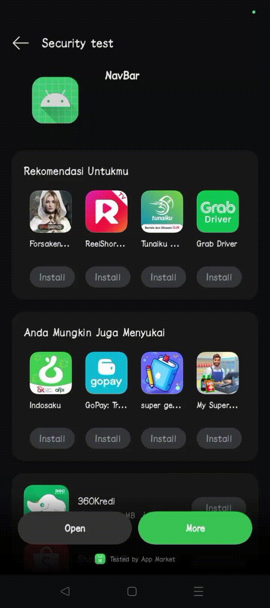

# Animated Navigation Bar dengan Perubahan Warna Layar

Aplikasi Android ini dibuat untuk memenuhi tugas mata kuliah Pemrograman Perangkat Bergerak. Aplikasi ini mendemonstrasikan penggunaan Animated Navigation Bar dengan efek perubahan warna layar saat berpindah tab.

## Tujuan

Tujuan dari pembuatan aplikasi ini adalah:

* Untuk menjawab dan memenuhi tanggung jawab pengerjaan tugas mata kuliah Pemrograman Perangkat Bergerak.
* Untuk memenuhi tugas yang diminta, yaitu membuat aplikasi yang menampilkan navigasi untuk halaman pertama ke halaman berikutnya.

## Setup

1. **Clone repository ini:**
2. **Buka proyek di Android Studio.**
3. **Tambahkan dependency berikut ke file `build.gradle (Module: app)`:**
4. **Build dan jalankan proyek di perangkat Android atau emulator.**

## Library/Dependency yang Digunakan

* **Jetpack Compose:** Untuk membangun UI deklaratif.
* **Accompanist System UI Controller:** Untuk mengontrol System UI (status bar dan navigation bar).
* **Animated Navigation Bar Library:** `com.exyte:animated-navigation-bar:1.0.0` -  Library khusus untuk membuat Animated Navigation Bar.

## Langkah Penggunaan

1. Jalankan aplikasi.
2. Klik pada salah satu tab di Navigation Bar.
3. Warna layar akan berubah sesuai dengan tab yang dipilih.
4. **Build dan jalankan proyek di perangkat Android atau emulator.**

## Demo

Berikut adalah demo aplikasi dalam bentuk file .gif:

## Running Hasil

Aplikasi ini berhasil menampilkan navigasi antar halaman dengan efek perubahan warna layar. Setiap tab pada Navigation Bar akan mengarahkan pengguna ke halaman yang berbeda dengan warna latar belakang yang unik. Animasi pada Navigation Bar memberikan pengalaman pengguna yang menarik dan interaktif.

## Catatan

* Anda dapat menyesuaikan warna dan menambahkan lebih banyak tab sesuai kebutuhan.
* Pastikan Anda telah menambahkan dependency `com.exyte:animated-navigation-bar:1.0.0` dan melakukan sync project.

## Kontribusi

Kontribusi sangat disambut! Jika Anda menemukan bug atau ingin menambahkan fitur baru, silakan buat pull request.